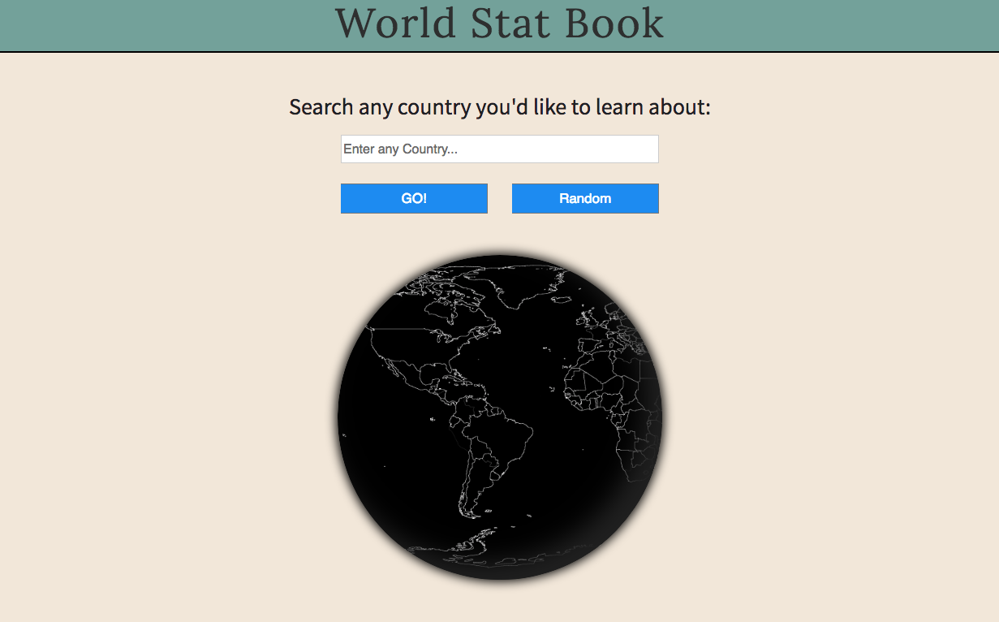
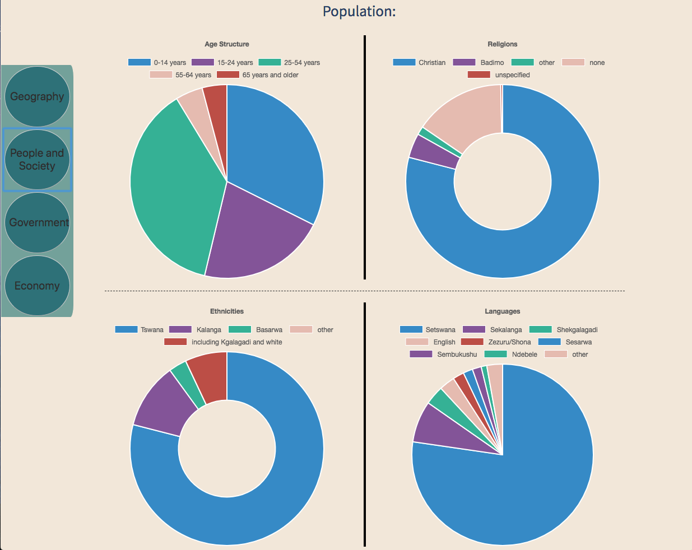
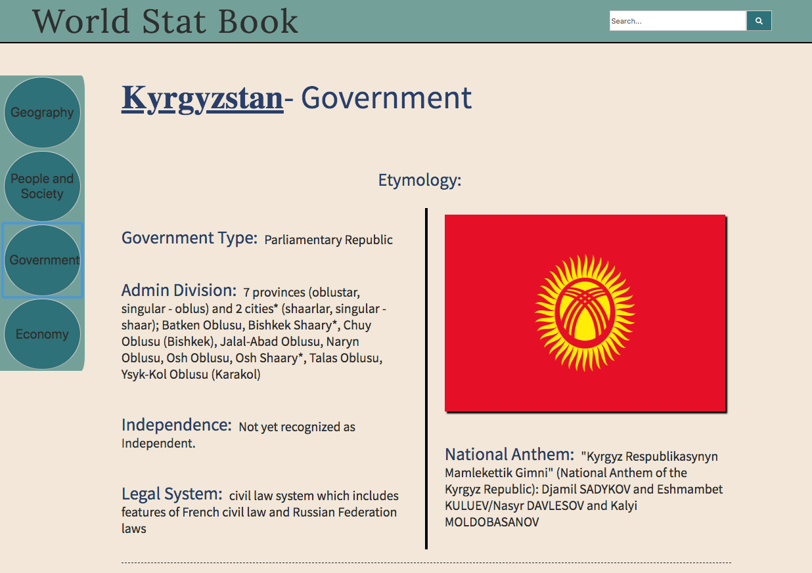

<h1>World Stat Book</h1>
Visit our webpage at www.worldstatbook.com

<h2>Description</h2>
This responsive web application allows users to search any country or territory by name and get information on them. Through a fan-made FBI World Factbook API and Chart.js, we were able to take in all the statistics on things like age structure, religion, ethnic group and GDP, and chart them on multiple types of graphs. This application also allows users to view the flag and the capital city of the searched country by utilizing the google maps API.

<h2>Technologies Used</h2>
<li>HTML5</li>
<li>CSS3</li>
<li>JavaScript</li>
<li>jQuery</li>
<li>Chart.js</li>
<li>World Factbook API</li>
<li>Google Maps API</li>
<li>Git</li>

<h4>Login Page</h4>

<h4>People and Society</h4>

<h4>Government</h4>

<h4>Economy<h4>

<h2>Authors</h2>
<li>Duong, Jeff</li>
<li>Pittman, Keith</li>
<li>Siegel, Sam</li>

<h2>Acknowledgments</h2>
We would like to thank Veronica Lino and our TA, Matthew Baxter. Also, we'd like to thank <a href="https://github.com/factbook/factbook.json">The World Factbook API</a> and <a href="https://developers.google.com/maps/documentation/">Google Maps</a> for their contributions.
